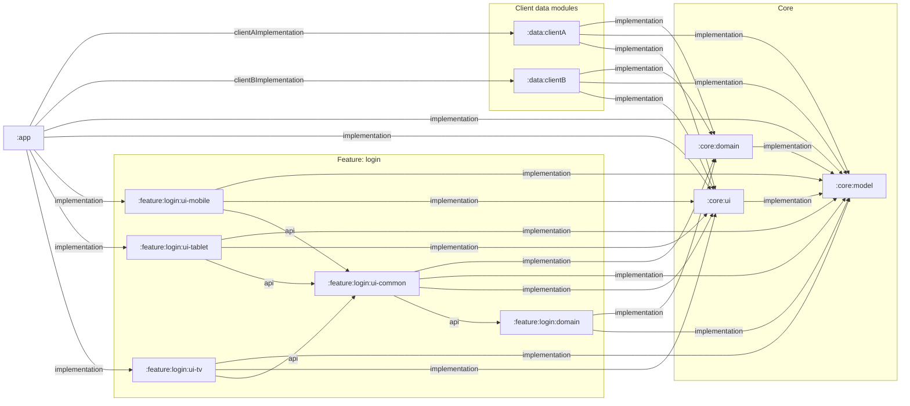

# Gradle Module Dependency Graph

Backend-agnostic module graph for project-to-project Gradle dependencies.



## Linear Import View

```text
:app
  clientAImplementation -> :data:clientA
    implementation -> :core:domain
      implementation -> :core:model
    implementation -> :core:model
    implementation -> :core:ui
      implementation -> :core:model
  clientBImplementation -> :data:clientB
    implementation -> :core:domain
      implementation -> :core:model
    implementation -> :core:model
    implementation -> :core:ui
      implementation -> :core:model
  implementation -> :core:model
  implementation -> :core:ui
    implementation -> :core:model
  implementation -> :feature:login:ui-mobile
    implementation -> :core:model
    implementation -> :core:ui
      implementation -> :core:model
    api -> :feature:login:ui-common
      implementation -> :core:domain
        implementation -> :core:model
      implementation -> :core:model
      implementation -> :core:ui
        implementation -> :core:model
      api -> :feature:login:domain
        implementation -> :core:domain
          implementation -> :core:model
        implementation -> :core:model
  implementation -> :feature:login:ui-tablet
    implementation -> :core:model
    implementation -> :core:ui
      implementation -> :core:model
    api -> :feature:login:ui-common
  implementation -> :feature:login:ui-tv
    implementation -> :core:model
    implementation -> :core:ui
      implementation -> :core:model
    api -> :feature:login:ui-common
```

## Direct Project Edges

| Source | Configuration | Target |
|---|---:|---|
| `:app` | `clientAImplementation` | `:data:clientA` |
| `:app` | `clientBImplementation` | `:data:clientB` |
| `:app` | `implementation` | `:core:model` |
| `:app` | `implementation` | `:core:ui` |
| `:app` | `implementation` | `:feature:login:ui-mobile` |
| `:app` | `implementation` | `:feature:login:ui-tablet` |
| `:app` | `implementation` | `:feature:login:ui-tv` |
| `:core:domain` | `implementation` | `:core:model` |
| `:core:ui` | `implementation` | `:core:model` |
| `:data:clientA` | `implementation` | `:core:domain` |
| `:data:clientA` | `implementation` | `:core:model` |
| `:data:clientA` | `implementation` | `:core:ui` |
| `:data:clientB` | `implementation` | `:core:domain` |
| `:data:clientB` | `implementation` | `:core:model` |
| `:data:clientB` | `implementation` | `:core:ui` |
| `:feature:login:domain` | `implementation` | `:core:domain` |
| `:feature:login:domain` | `implementation` | `:core:model` |
| `:feature:login:ui-common` | `implementation` | `:core:domain` |
| `:feature:login:ui-common` | `implementation` | `:core:model` |
| `:feature:login:ui-common` | `implementation` | `:core:ui` |
| `:feature:login:ui-common` | `api` | `:feature:login:domain` |
| `:feature:login:ui-mobile` | `implementation` | `:core:model` |
| `:feature:login:ui-mobile` | `implementation` | `:core:ui` |
| `:feature:login:ui-mobile` | `api` | `:feature:login:ui-common` |
| `:feature:login:ui-tablet` | `implementation` | `:core:model` |
| `:feature:login:ui-tablet` | `implementation` | `:core:ui` |
| `:feature:login:ui-tablet` | `api` | `:feature:login:ui-common` |
| `:feature:login:ui-tv` | `implementation` | `:core:model` |
| `:feature:login:ui-tv` | `implementation` | `:core:ui` |
| `:feature:login:ui-tv` | `api` | `:feature:login:ui-common` |
