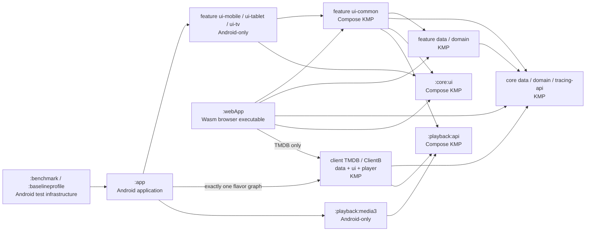

# Gradle Module Dependency Graph

Android/KMP plus WEB-01 graph. The target architecture is backend-agnostic: app, core, feature, and playback contracts do not depend on provider DTOs or SDKs.


```mermaid
flowchart LR
    App[":app\nAndroid application"]
    PlatformUI["feature ui-mobile / ui-tablet / ui-tv\nAndroid-only"]
    CommonUI["feature ui-common\nCompose KMP"]
    FeatureDomain["feature data / domain\nKMP"]
    Core["core data / domain / tracing-api\nKMP"]
    CoreUI[":core:ui\nCompose KMP"]
    Providers["client TMDB / ClientB\ndata + ui + player\nKMP"]
    Media3[":playback:media3\nAndroid-only"]
    Playback[":playback:api\nCompose KMP"]
    Benchmark[":benchmark / :baselineprofile\nAndroid test infrastructure"]
    Web[":webApp\nWasm browser executable"]

    App --> PlatformUI
    PlatformUI --> CommonUI
    PlatformUI --> CoreUI
    CommonUI --> FeatureDomain
    CommonUI --> Core
    CommonUI --> CoreUI
    FeatureDomain --> Core
    App -->|exactly one flavor graph| Providers
    Providers --> Core
    Providers --> Playback
    App --> Media3
    Media3 --> Playback
    CommonUI --> Playback
    Benchmark --> App
    Web --> CommonUI
    Web --> FeatureDomain
    Web --> Core
    Web --> CoreUI
    Web -->|TMDB only| Providers
```

## Module classes

| Class | Modules | Target/source-set rule |
|---|---|---|
| Android application | `:app` | Android application; navigation, activity, platform composition root, flavor selection |
| Android UI | `:feature:*:ui-mobile`, `ui-tablet`, `ui-tv` | Android library; touch/adaptive/TV focus behavior remains platform-owned |
| Plain KMP | `:core:data`, `:core:domain`, `:core:tracing-api`, feature data/domain, provider data/player | `commonMain` first; Android construction such as DataStore/engine setup in `androidMain` |
| Compose KMP | `:core:ui`, every `:feature:*:ui-common`, provider UI, `:playback:api` | Portable state/ViewModels/resources/components in `commonMain`; Android-only TV/configuration APIs in `androidMain` |
| Android engine | `:playback:media3`, `:core:tracing` | Media3 and Android tracing implementations |
| Test infrastructure | `:benchmark`, `:benchmark:ui-driver`, `:baselineprofile` | TMDB-only Android benchmark/profile producers; generated profiles merge into app main |
| Web executable | `:webApp` | Only browser/executable Wasm target; runtime config and web composition root |

WEB-01 adds library-only Wasm targets to the exact 28-module TMDB closure and makes `:webApp` the sole browser executable. ClientB, Android platform
UI, Media3, Android tracing, benchmark, and baseline-profile modules remain outside the web graph.

## Application and provider composition

`:app` depends on all platform UI surfaces, `:core:{data,domain,ui}`, `:feature:{search,library,player}:data`, `:playback:{api,media3}`, and one mutually exclusive provider graph:

```text
tmdbImplementation    -> :client:tmdb:{data,ui,player}
clientBImplementation -> :client:clientB:{data,ui,player}
```

The common Android Koin composition root combines process modules with exactly one flavor module list. Provider data modules implement backend-agnostic core/search contracts. Provider player modules bind only `PlaybackSourceRepository`; `:playback:media3` owns `PlaybackSessionFactory`.

## Feature pattern

For Login, Profiles, Home, Search, Details, and Library:

```text
:feature:<name>:ui-{mobile,tablet,tv}
  api -> :feature:<name>:ui-common
  -> :core:{data,ui}

:feature:<name>:ui-common
  -> feature data/domain contracts
  -> backend-agnostic core/playback contracts as required

:feature:<name>:domain/data
  -> :core:{data,domain} as required
```

Player uses `ui-mobile` and `ui-tv`; both expose `:feature:player:ui-common`, which exposes `:feature:player:domain` and `:playback:api`. Details additionally consumes Library and Player domain policies.

## Direct infrastructure edges

```text
:core:domain -> :core:data
:core:ui -> :core:data
:core:tracing -> api(:core:tracing-api)
:playback:api -> api(:core:data)
:playback:media3 -> api(:playback:api)
:benchmark -> :benchmark:ui-driver
:baselineprofile -> :benchmark:ui-driver
```

## Boundary gates

- Koin 4.2.2 classic constructor DSL only; no Hilt/Dagger or service location in business code.
- Provider DTOs remain internal to their client data module and never cross into core/domain/feature UI.
- Shared dependencies must publish compatible KMP metadata and Android variants; `verifyKmpDependencyCompatibility` enforces the locked set.
- Common tests opt into `testAndroidHostTest`; `verifyKmpTestTargets` prevents source/task drift or zero-test suites.
- Compose KMP Android compilation uses `-Xlambdas=class`; `verifyKmpAndroidCompilerFlags` checks every production compile task.
- Compose Resources live under `commonMain/composeResources`. Resource-owning Android-KMP modules must package them through Android resource processing; provider UI AAR/APK assets are part of the Android parity gate.
- Compile SDK is 37 throughout. App, benchmark, and baseline-profile target SDK remains 36.
