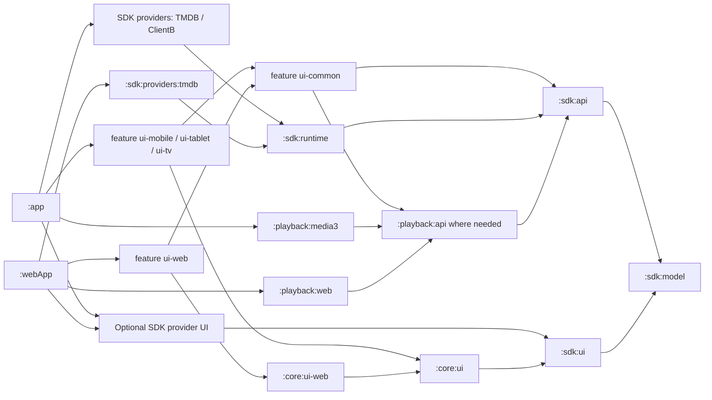

# Gradle Module Dependency Graph

Current module ownership follows `settings.gradle.kts` and the module build scripts. The target architecture is backend-agnostic: shared UI consumes public SDK contracts, and application composition roots select provider factories. Provider DTOs and backend integrations do not enter feature UI.

The diagram groups related modules and shows their principal dependency directions; it is not an exhaustive list of every Gradle edge.


```mermaid
flowchart LR
    App[":app"] --> AndroidUI["feature ui-mobile / ui-tablet / ui-tv"]
    Web[":webApp"] --> WebUI["feature ui-web"]
    AndroidUI --> CommonUI["feature ui-common"]
    WebUI --> CommonUI
    AndroidUI --> CoreUI[":core:ui"]
    WebUI --> CoreWeb[":core:ui-web"]
    CoreWeb --> CoreUI
    CommonUI --> API[":sdk:api"]
    API --> Model[":sdk:model"]
    App --> Providers["SDK providers: TMDB / ClientB"]
    Web --> Tmdb[":sdk:providers:tmdb"]
    Providers --> Runtime[":sdk:runtime"]
    Tmdb --> Runtime
    Runtime --> API
    App --> ProviderUI["Optional SDK provider UI"]
    Web --> ProviderUI
    ProviderUI --> SdkUI[":sdk:ui"]
    CoreUI --> SdkUI
    SdkUI --> Model
    CommonUI --> Playback[":playback:api where needed"]
    Playback --> API
    App --> Media3[":playback:media3"]
    Web --> WebEngine[":playback:web"]
    Media3 --> Playback
    WebEngine --> Playback
```

## Module classes

| Class | Modules | Ownership and targets |
|---|---|---|
| Application roots | `:app`, `:webApp` | Android app and browser application; navigation, runtime configuration, SDK construction, Koin wiring |
| Headless SDK | `:sdk:model`, `:sdk:api`, `:sdk:runtime`, `:sdk:providers:tmdb`, `:sdk:providers:clientB` | Android/Wasm libraries; backend-agnostic models/services, runtime policy, provider implementations |
| Optional SDK presentation | `:sdk:ui`, `:sdk:providers:tmdb:ui`, `:sdk:providers:clientB:ui` | Android/Wasm resources and presentation mappings; no application screens, Koin, or playback engines |
| Shared SDK test sources | `:sdk:testing` | Base-plugin support project; provider `commonTest` compilations include its sources; no publication or independent test task |
| Application design system | `:core:ui`, `:core:ui-web` | Shared Compose rendering/tokens and browser-specific helpers |
| Feature state/rendering | `:feature:*:ui-common` | Shared UI contracts, ViewModels, portable components; SDK API/model consumers |
| Android feature UI | `:feature:*:ui-mobile`, `ui-tablet`, `ui-tv` | Touch/adaptive/TV rendering and interaction; Player has mobile and TV modules, no separate tablet module |
| Browser feature UI | `:feature:*:ui-web` | Browser rendering, DOM/input/focus integration; Profiles and Player declare executable browser test bundles |
| Playback | `:playback:api`, `:playback:media3`, `:playback:web` | Shared application playback contracts, Android Media3, and Wasm/Shaka engine |
| Tracing | `:core:tracing-api`, `:core:tracing` | Shared contracts and Android tracing implementation |
| Performance tests | `:benchmark`, `:benchmark:ui-driver`, `:baselineprofile` | Android benchmark/profile producers; generated profiles remain application inputs |
| Build fixtures | `:kmp-convention-fixtures:plain`, `:kmp-convention-fixtures:compose` | Verify reusable Android-KMP conventions |

`:webApp` produces the deployable browser application. Browser test targets also exist in runtime, playback, and feature modules; those targets do not imply separate deployable products. Both headless providers support Wasm, but the browser application currently selects TMDB.

## SDK and application composition

The headless dependency direction is:

```text
:sdk:providers:<provider> -> :sdk:runtime -> :sdk:api -> :sdk:model
:sdk:providers:<provider> -> api(:sdk:api)

:sdk:providers:<provider>:ui -> api(:sdk:ui) -> api(:sdk:model)
```

Provider factories compose runtime services and internal backend implementations. Runtime services own validation, authorization, session/profile state, and SDK-local library/search-history/playback-progress persistence. Optional presentation remains outside the headless dependency closure.

The Android app chooses exactly one provider and its presentation module through flavor dependencies:

```text
tmdbImplementation    -> :sdk:providers:tmdb, :sdk:providers:tmdb:ui
clientBImplementation -> :sdk:providers:clientB, :sdk:providers:clientB:ui
```

The browser root constructs the TMDB Wasm client. Each application root owns one SDK client, registers public services/presentation implementations in Koin, and closes the client with its container. Feature code uses SDK API/model contracts; it does not construct providers or access runtime stores. Playback factories create application-owned sessions, while the SDK owns source resolution and progress operations.

## Feature and infrastructure dependencies

```text
:feature:<name>:ui-{mobile,tablet,tv,web} -> :feature:<name>:ui-common
:feature:<name>:ui-common -> :sdk:api / :sdk:model
:core:ui -> api(:sdk:ui)
:core:ui-web -> api(:core:ui)
:playback:api -> api(:sdk:api)
:playback:media3 -> api(:playback:api)
:playback:web -> :playback:api
:core:tracing -> api(:core:tracing-api)
:benchmark -> :benchmark:ui-driver
:baselineprofile -> :benchmark:ui-driver
```

Platform modules also consume the shared design system and appropriate platform libraries. Details and Player consume application playback contracts. The former core data/domain, feature data/domain, and client module groups were replaced by SDK ownership; historical evidence retains their original paths.

## Boundary and verification gates

- Koin 4.2.2 classic constructor DSL stays in application/UI/playback composition boundaries; it is absent from SDK publications.
- Five headless artifacts run `verifySdkHeadlessDependencies`; three optional presentation artifacts run `verifySdkUiDependencies`.
- `tools/sdk/verify_sdk.py` checks SDK source/import and publication metadata boundaries; `tools/sdk/verify-publication.ps1` stages all eight artifacts and exercises standalone coordinate-only consumers.
- Provider contract helpers stay in `sdk/testing/src/commonTest/kotlin`, included by each provider's test source set.
- `verifyKmpDependencyCompatibility`, `verifyKmpTestTargets`, `verifyKmpConventionPlugins`, and `verifyKmpAndroidCompilerFlags` guard shared build configuration. Device/browser checks remain separate.
- Compose Resource owners enable Android resource processing; standalone Android/Wasm presentation consumers verify published resources.
- Compile SDK is 37; application, benchmark, and baseline-profile target SDK remains 36. Android-KMP libraries are single-variant.

See [SDK integration](docs/tracked/sdk/integration.md) for public contracts and publication commands, [SDK verification](docs/tracked/sdk/verification.md) for executed checks, and [KMP conventions](docs/tracked/kmp/build-conventions.md) for target/source-set setup.
