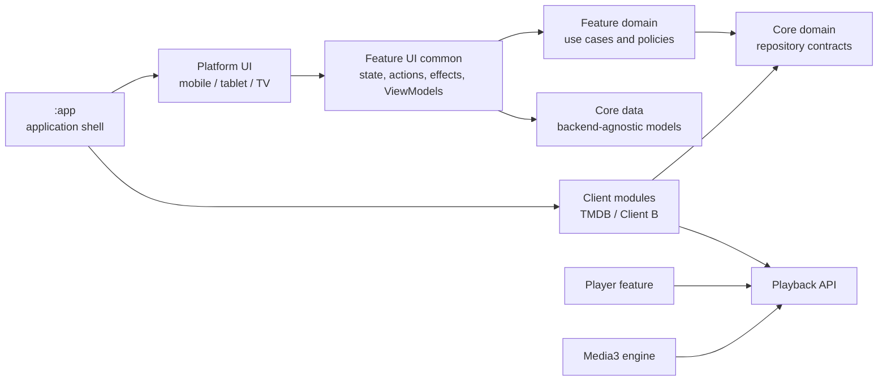

# StreamCore TV

Compose-first Android VOD application for mobile, tablet, and TV. StreamCore TV is designed as a reusable, backend-agnostic streaming foundation: shared core, domain, and feature UI modules do not depend on provider SDKs, DTOs, or API response models.

> [!NOTE]
> This project is under active development. The `tmdb` flavor is the reference integration; `clientB` demonstrates how another provider can be connected without leaking provider types into shared modules.

## Highlights

- One application targeting Android phones, tablets, and Android TV
- Adaptive Material 3 UI for touch devices
- Compose for TV components, D-pad navigation, and 10-foot layouts
- Login, profile management, catalogue browsing, content details, and playback flows
- Provider-swappable data and playback implementations through repository contracts
- Media3 playback with progress persistence and Picture-in-Picture support
- Immutable UI state with UDF, `StateFlow`, and lifecycle-aware collection
- Client-specific product flavors: `tmdb` and `clientB`

## Architecture

The project follows Clean Architecture in a multi-module setup. Routes collect state and handle navigation, stateless screens render immutable UI state, and ViewModels expose a single `StateFlow` per screen. Provider implementations remain at the outer edge of the dependency graph.



### Modules

| Group | Responsibility |
| --- | --- |
| `:app` | Application entry point, navigation, dependency wiring, and client flavor selection |
| `:core:data` | Shared application models and infrastructure result/error contracts |
| `:core:domain` | Provider-independent repository interfaces |
| `:core:ui` | Theme, design tokens, shared components, previews, and UI utilities |
| `:feature:<name>:domain` | Feature use cases and business rules |
| `:feature:<name>:ui-common` | Shared UI contracts, ViewModels, and platform-neutral components |
| `:feature:<name>:ui-mobile` | Phone-specific touch UI |
| `:feature:<name>:ui-tablet` | Adaptive tablet UI |
| `:feature:<name>:ui-tv` | TV UI, focus behavior, and D-pad interaction |
| `:client:<client>:data` | DTOs, networking, persistence, mappers, and repository implementations |
| `:client:<client>:ui` | Client-owned artwork and presentation mappings |
| `:client:<client>:player` | Client playback-source resolution |
| `:playback:api` | Provider- and engine-independent playback contracts |
| `:playback:media3` | AndroidX Media3 playback implementation |

Current feature areas are `login`, `profiles`, `home`, `details`, and `player`.

## Tech stack

- Kotlin 2.3
- Jetpack Compose and Material 3
- Compose for TV
- Coroutines, Flow, and StateFlow
- Navigation Compose
- Koin 4.2.2 with constructor injection
- Ktor and Kotlinx Serialization
- AndroidX Media3
- DataStore
- Coil
- JUnit and Compose UI testing

## Getting started

### Requirements

- Android Studio with support for Android Gradle Plugin 9.1.1
- JDK 17 or newer (the Android Studio bundled runtime is recommended)
- Android SDK 37 (the shipping application continues to target SDK 36)
- An emulator or device running Android 8.0 / API 26 or newer

Clone the repository and open its root directory in Android Studio. Gradle uses the checked-in wrapper (`9.3.1`) and version catalog.

### Configure the TMDB flavor

The TMDB integration reads credentials from Gradle properties or the untracked root `local.properties` file. Add the following values for the complete authenticated flow:

```properties
tmdbReadAccessToken=YOUR_TMDB_READ_ACCESS_TOKEN
tmdbAccountId=YOUR_TMDB_ACCOUNT_ID
```

Do not commit credentials. `local.properties` is already ignored by Git.

The `clientB` flavor uses local placeholder implementations and does not require TMDB credentials.

## Build and run

Select `tmdbDebug` or `clientBDebug` from Android Studio's **Build Variants** tool window, then run the `app` configuration on a phone, tablet, or Android TV target.

From the command line:

```bash
# TMDB reference integration
./gradlew :app:assembleTmdbDebug

# Alternative client integration
./gradlew :app:assembleClientBDebug
```

On Windows, replace `./gradlew` with `.\gradlew.bat`.

## Verification

```bash
# Run the project verification lifecycle, including unit tests and design-token checks
./gradlew check

# Build the reference application
./gradlew :app:assembleTmdbDebug

# Run a focused migrated feature test suite
./gradlew :feature:home:domain:testAndroidHostTest

# Run the design-system token guard directly
./gradlew verifyDesignTokens
```

Compose instrumentation tests require a connected emulator or device and can be run from Android Studio or through the relevant module's `connectedDebugAndroidTest` task.

## Project conventions

- UI consumes only shared `Model`, `UiState`, `Action`, and `Effect` types.
- Provider DTOs and SDK details remain internal to client modules.
- Screen composables are stateless and preview-friendly; routes own ViewModel access and lifecycle-aware state collection.
- Lazy layouts use stable keys and content types where applicable.
- TV implementations explicitly handle focus, D-pad navigation, spacing, and readability.
- Raw UI values are guarded by `verifyDesignTokens`; feature code should use the shared design system.

## Documentation

- [Product direction](PRODUCT.md)
- [Design system](DESIGN.md)
- [Feature module template](docs/guidelines/feature-template.md)
- [Module dependency graph](MODULE_DEPENDENCY_GRAPH.md)
- [Codebase review](CODEBASE_REVIEW.md)

## TMDB attribution

This product uses the TMDB API but is not endorsed or certified by TMDB. TMDB credentials and usage remain subject to TMDB's terms and policies.
