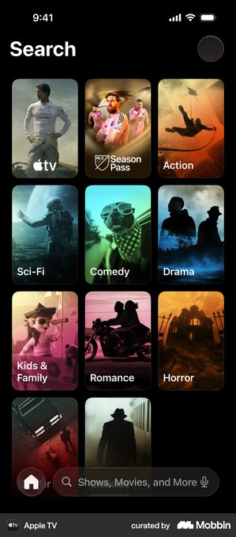
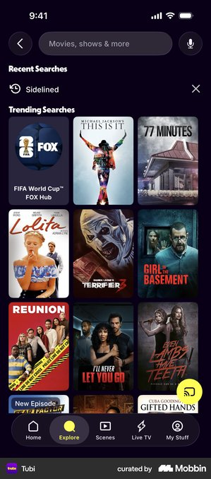
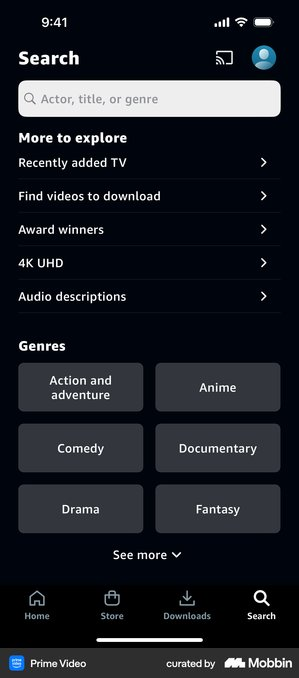
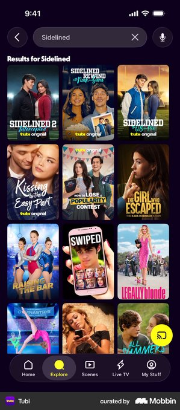
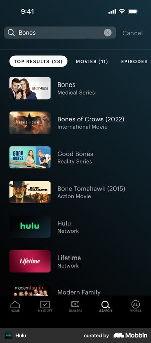
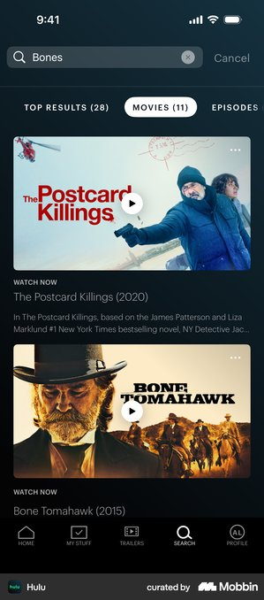
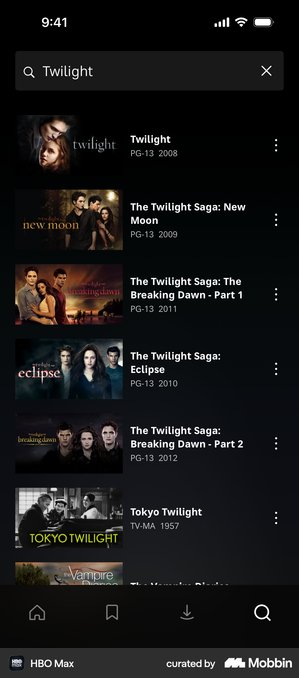
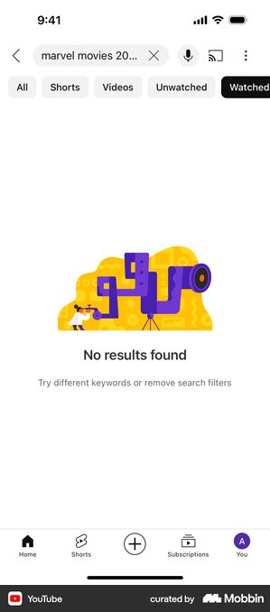

# Mobile Search UI Specification

Status: design direction for later implementation  
Target: Android mobile, Jetpack Compose, Material 3  
Product register: premium, cinematic, calm, content-led  
Architecture constraint: backend-agnostic feature/domain/UI boundaries

## 1. Outcome

The mobile search screen should help a subscriber find a film or series with the fewest possible decisions.

The screen is a full-screen destination opened from the Home search action. It auto-focuses the query field on first entry, shows compact
recent/trending suggestions while the query is blank, then replaces them with one adaptive poster grid as live results arrive.

Do not turn Search into a second Home screen. Genres, editorial shelves, filter panels, voice search, and multiple result tabs are intentionally out
of scope for the first version.

## 2. Mobbin research

These references are pattern inputs, not layouts to clone. The useful common pattern is an immediately identifiable search control, minimal chrome,
content-led results, and a distinct recovery state.

Mobbin's mobile results used here are iOS references. The specification extracts interaction and information-hierarchy patterns, then adapts them to
Android system Back, IME, Material 3, Compose, and StreamCoreTV's existing tokens.

### Blank and discovery states

#### Apple TV — visual discovery

[Open the Apple TV screen on Mobbin](https://mobbin.com/screens/2440ea8e-1967-4e6c-8243-9dd06069aabc)



- Strong: artwork makes blank search useful and cinematic.
- Avoid: the floating bottom search field is platform-specific and conflicts with Android's expected top search placement.
- Distilled lesson: give the blank state utility, but keep the query control fixed at the top.

#### Tubi — recent query plus trending content

[Open the Tubi screen on Mobbin](https://mobbin.com/screens/f34a6c43-6483-4a54-94db-325d989f8ff9)



- Strong: a recent query is immediately reusable; trending content prevents a dead end.
- Avoid: a dense three-column wall before the user searches competes with the primary task.
- Distilled lesson: cap recent queries and trending suggestions; do not reproduce an entire catalogue.

#### Prime Video — structured browse taxonomy

[Open the Prime Video screen on Mobbin](https://mobbin.com/screens/9eea0ab0-05f6-4ffe-b652-58065258e32f)



- Strong: plain-language entry points and large touch targets.
- Avoid: categories duplicate Home discovery and add a second information architecture.
- Distilled lesson: keep genre/category browse in Home unless product data later proves users need it in Search.

### Result states

#### Tubi — dense poster results

[Open the Tubi results screen on Mobbin](https://mobbin.com/screens/abeddef8-b9d6-4c73-9358-e15dbdd5e0a2)



- Strong: fast visual scanning and clear relationship between query and results.
- Avoid: titles embedded in busy artwork can lose contrast and localization space.
- Distilled lesson: use posters for recognition, with title and metadata outside the artwork.

#### Hulu — scoped top results

[Open the Hulu top-results screen on Mobbin](https://mobbin.com/screens/aac78001-ab81-49ed-ac1e-89fedfb63243)



- Strong: thumbnails, title, and type make mixed results understandable.
- Avoid: tabs require reliable result taxonomy and create more decisions before value.
- Distilled lesson: ship one relevance-ranked result set first. Add filters only when supported by measured result volume and backend capability.

#### Hulu — rich movie results

[Open the Hulu movie-results screen on Mobbin](https://mobbin.com/screens/4a8d629e-4c3a-4ca9-86f0-244afbb7dbd6)



- Strong: artwork and metadata support confident selection.
- Avoid: large editorial cards reduce result density and imply playback actions before selection.
- Distilled lesson: Search should navigate to details; it should not become an inline details/player surface.

#### HBO Max — compact metadata list

[Open the HBO Max results screen on Mobbin](https://mobbin.com/screens/efa731f9-f0f6-4d3e-9750-c2ca6316e1a6)



- Strong: titles and year/availability metadata remain readable.
- Avoid: overflow menus introduce unclear secondary actions.
- Distilled lesson: each result has one action: open details.

### Empty state

#### YouTube — direct recovery guidance

[Open the YouTube no-results screen on Mobbin](https://mobbin.com/screens/0681e212-d198-4ad2-9c8e-2292ebdff086)



- Strong: the state is named and gives a specific recovery path.
- Avoid: decorative illustration does not add product value for StreamCoreTV.
- Distilled lesson: preserve the query, explain what to change, and offer one clear recovery action.

## 3. Distilled product direction

### Primary user goal

Find a playable film or series and open its details.

### Essential elements

1. Back action.
2. Persistent query field.
3. Clear-query action when text is present.
4. Recent/trending suggestions while the query is blank.
5. Relevance-ranked content results.
6. Designed loading, empty, offline, and error states.

### Removed complexity

| Removed from v1                     | Reason                                            | Reconsider when                                    |
|-------------------------------------|---------------------------------------------------|----------------------------------------------------|
| Genre/category tiles                | Duplicates Home discovery                         | Search analytics show strong browse intent         |
| Movies/series/people tabs           | Adds decisions and requires complete taxonomy     | Result sets routinely exceed useful scanning depth |
| Filter button/sheet                 | No validated filter need                          | A concrete backend-neutral filter contract exists  |
| Voice search                        | Permission, error, locale, and capability surface | Speech input is a committed product capability     |
| Inline play button                  | Competes with the single result action            | Product explicitly supports safe instant play      |
| Result overflow menus               | No essential secondary action                     | A real cross-content action is defined             |
| Decorative empty-state illustration | Visual noise and extra asset ownership            | A branded asset has a product purpose              |

## 4. Screen anatomy

```text
System status bar
┌──────────────────────────────────────┐
│ ←  [ Search films and series      × ]│  sticky search header
├──────────────────────────────────────┤
│                                      │
│  Blank query                         │
│  Recent searches                     │
│  Trending searches                   │
│                                      │
│  OR                                  │
│                                      │
│  Results                             │
│  [poster] [poster] [poster/adaptive] │
│  title    title    title             │
│  meta     meta     meta              │
│                                      │
└──────────────────────────────────────┘
System navigation / IME
```

### Search header

- Full-screen route; no duplicate `Search` title above the field.
- `20dp` horizontal screen padding and `8dp` top/bottom spacing.
- Back icon has a `48dp` touch target.
- Field height: `52dp`.
- Field shape: `12dp`, matching the existing restrained shape vocabulary.
- Field color: `MaterialTheme.colorScheme.surfaceContainerHigh`.
- Text/icon color: `onSurface`; placeholder: `onSurfaceVariant` with verified `4.5:1` contrast.
- Leading icon: design-system search vector, decorative to screen readers because the field label already identifies the control.
- Trailing clear icon appears only when the query is non-empty and keeps keyboard focus after clearing.
- Placeholder: `Search films and series`.
- Keyboard: text input, sentence capitalization off, autocorrect off, `ImeAction.Search`.
- No border plus shadow pairing. Use tonal contrast only.

### Blank-query content

- On first route entry from Home, request focus and open the IME.
- Preserve the field, query, result scroll position, and results when returning from Details.
- Show at most five recent queries, newest first.
- A recent-query row contains a history icon, one-line query, and a remove action with a `48dp` target.
- `Clear all` is a tertiary text action aligned with the `Recent searches` heading.
- Show at most six backend-provided trending searches below recents.
- Render trending suggestions as compact rows with a `16:9` thumbnail, title, and one metadata line. The row has one action: execute the query/open
  its result.
- If neither source exists, show concise helper copy: `Search by title, cast, or keyword.` Only mention cast if the backend-neutral contract supports
  it.

### Results

- Begin remote search after a normalized query reaches two characters.
- Use a `300ms` debounce for typing and execute immediately on IME Search or recent-query selection.
- Cancel obsolete work with `flatMapLatest`.
- Header text: `Results`—do not show a count unless the repository provides a trustworthy total.
- Use `LazyVerticalGrid(GridCells.Adaptive(minSize = 120.dp))` with `12dp` horizontal and `16dp` vertical spacing.
- Posters use the shared `2:3` aspect ratio and `10dp` shape.
- Keep title and metadata outside the artwork: title `labelLarge`, maximum two lines; metadata `labelSmall`, maximum one line.
- Each result has one interaction: open Details.
- Stable key: content identity plus result type. Stable `contentType` must be supplied.
- Use the existing shared artwork/title transition with a stable search row identity, for example `search:<normalized-query>`.

The adaptive grid is intentionally search-specific. It preserves the established `120dp` poster density as the minimum while allowing two columns on
narrower phones and three on wider phones. Do not reuse a fixed-width horizontal Home shelf inside the vertical result grid.

## 5. State behavior

| State                       | UI behavior                                                                                                                   |
|-----------------------------|-------------------------------------------------------------------------------------------------------------------------------|
| Initial                     | Focus field, open IME, show recent and trending suggestions                                                                   |
| Query below threshold       | Keep suggestions visible; do not call repository                                                                              |
| Searching                   | Replace stale results; show poster skeletons only after `150ms` to avoid flashes                                              |
| Results                     | Show one relevance-ranked grid; retain query and scroll state                                                                 |
| No results                  | Keep query; show `No results for “{query}”` and `Try another title or check the spelling.` Primary recovery is `Clear search` |
| Offline with cached results | Keep cached results and show a non-blocking offline message                                                                   |
| Offline without results     | Keep query; show `You're offline` and a `Try again` action                                                                    |
| Error                       | Keep query; show inline error copy and `Try again`; never use a modal                                                         |
| Returning from Details      | Restore results and exact scroll position; do not reopen IME automatically                                                    |

System Back behavior:

1. If the IME is open, dismiss it.
2. Otherwise navigate back to Home.

Do not make Back clear the query; the explicit clear action owns that behavior.

## 6. Visual alignment with StreamCoreTV

- Prefer the dark cinematic scheme on Search when entered from the dark Home surface; respect the existing mobile theme behavior rather than
  hardcoding dark colors.
- Use `background`, `onBackground`, `surfaceContainerHigh`, `onSurface`, and `onSurfaceVariant` roles.
- Reserve StreamCore orange (`primary`) for focused/active state, progress, and the selected navigation destination—not decorative borders or
  headings.
- Keep artwork flat; no card shadows or decorative outlines.
- Use the existing system typography. The screen needs only `titleMedium`, `labelLarge`, `bodyMedium`, and `labelSmall`.
- Reuse `StreamCoreContentImage` and the shared artwork fallback behavior.
- Add an app-owned `StreamCoreSearchField` only if it will be reused by mobile/tablet; keep platform interaction assumptions out of `ui-common`.

## 7. Motion

- Field focus and clear are immediate.
- Crossfade content state changes in `180–220ms`; do not animate layout height or stagger every result.
- Use the existing shared element transition from a selected result into Details.
- Skeletons do not shimmer continuously; use a restrained static tonal placeholder or a reduced-motion-safe pulse.
- Respect system animator duration/reduced-motion settings.

## 8. Accessibility and localization

- Every icon action has a localized content description; decorative icons are excluded from semantics.
- All interactive targets are at least `48dp`.
- Announce `Results loaded`, `No results`, and failure states through an appropriate live region without announcing every keystroke.
- Never encode loading/error/selection using color alone.
- Support font scaling without clipping the field or result metadata.
- Query, titles, and state copy must handle bidirectional text.
- Do not interpolate untrusted query text into unescaped rich text.
- Keep recent-query delete actions distinct: `Remove {query} from recent searches`.

## 9. Compose and architecture handoff

Recommended modules:

```text
:feature:search:domain
  SearchRepository.kt
  SearchContentUseCase.kt
  LoadSearchDiscoveryUseCase.kt
  ObserveRecentSearchesUseCase.kt

:feature:search:ui-common
  common/search/SearchAction.kt
  common/search/SearchEffect.kt
  common/search/SearchUiState.kt
  common/search/SearchContentState.kt
  common/search/SearchViewModel.kt
  common/search/SearchRouteEventEffect.kt
  common/testing/SearchPreviewData.kt

:feature:search:ui-mobile
  mobile/search/MobileSearchRoute.kt
  mobile/search/MobileSearchScreen.kt
  mobile/search/MobileSearchField.kt
  mobile/search/MobileSearchResultsGrid.kt
```

Rules:

- The target architecture remains backend-agnostic.
- `SearchRepository` and use cases expose common `ContentModel`/domain search models only.
- Provider DTOs, SDK concepts, and capability quirks stay in `:data:<client>`.
- `MobileSearchRoute` owns ViewModel access, `collectAsStateWithLifecycle()`, focus/IME orchestration, effects, and navigation callbacks.
- `MobileSearchScreen` is stateless and preview-friendly.
- `SearchViewModel` exposes one immutable `StateFlow<SearchUiState>` and receives `SearchAction`.
- Put each public model, sealed contract, and enum in its own file.
- Avoid mutable collections in state; use persistent/immutable lists if already available, otherwise immutable `List` values.

Suggested UI contract shape:

```kotlin
data class SearchUiState(
    val query: String = "",
    val recentQueries: List<String> = emptyList(),
    val trending: List<ContentModel> = emptyList(),
    val content: SearchContentState = SearchContentState.Discovery,
)

sealed interface SearchContentState {
    data object Discovery : SearchContentState
    data object Loading : SearchContentState
    data class Results(val items: List<ContentModel>) : SearchContentState
    data class Empty(val query: String) : SearchContentState
    data class Failure(val error: AppError) : SearchContentState
}
```

Split these types into separate files in implementation, in accordance with project model rules.

## 10. Performance implications

- Debounce and `flatMapLatest` prevent request floods and stale result races.
- Normalize the query outside composables and avoid derived list/filter allocations during recomposition.
- Use stable keys/content types in both suggestion lists and the result grid.
- Request appropriately sized poster assets; do not decode full-resolution artwork for `120dp` cells.
- Keep the search field outside the lazy grid so typing does not rebuild the result item tree unnecessarily.
- Avoid collecting per-card flows; fold content state into the single screen state.
- Do not retain Activity, FocusRequester, or keyboard controller references in the ViewModel.

## 11. Required previews and tests

Screen previews, wrapped in `StreamCoreTheme` and placed at the end of `MobileSearchScreen.kt`:

- Discovery with recents and trending.
- Results in dark theme.
- Results in light theme.
- Loading skeletons.
- Empty result.
- Offline/error.
- Long localized query and titles.

Focused tests:

- Debounce, query normalization, and cancellation of stale searches.
- Immediate IME/recent-query search.
- Recent-query add/remove/clear behavior.
- Results, empty, cached-offline, and error state transitions.
- Query and scroll restoration after Details.
- Search field clear semantics and minimum touch targets.
- Stable result identity and single navigation effect per selection.

## 12. Acceptance criteria

- Search opens from the Home search icon and the icon is no longer disabled.
- First entry focuses the field and opens the keyboard.
- No repository request occurs below two normalized characters.
- Live search uses `300ms` debounce and cancels stale work.
- Query, results, and scroll position survive a Details round trip.
- Blank, loading, content, empty, offline, and error states are all designed and previewed.
- Result selection opens Details through a one-shot effect.
- Feature UI imports no provider/client DTO or SDK type.
- All reusable/screen composables have the required previews.
- Contrast, semantics, font scaling, and `48dp` targets pass accessibility verification.
- Grid items use stable keys and content types.

## 13. Follow-up after implementation

Run an Impeccable polish pass against rendered compact and wide-phone screenshots. Validate hierarchy, typography, state transitions, touch targets,
dark/light contrast, long localized content, and whether the blank state is still too close to Home discovery.
